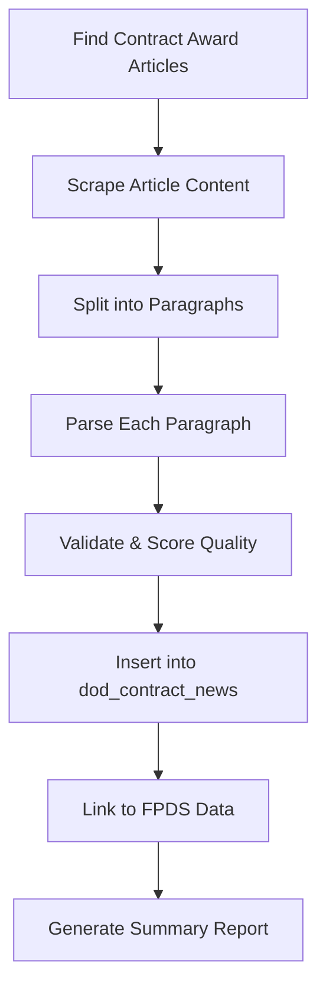

# DoD Contract Awards News Scraper - Research & Design

## 🎯 **Target Site:**
**URL:** https://www.defense.gov/News/Releases/ (Note: war.gov doesn't exist - this is defense.gov)

**Example Release:** https://www.defense.gov/News/Releases/Release/Article/3981590/dod-announces-2024-defense-acquisition-awards/

---

## 📊 **What This Data Contains:**

### **Value Proposition:**
DoD releases **daily contract award announcements** with rich details in paragraph form:
- Contract numbers
- Vendor names and locations
- Award amounts
- Contract descriptions (more detailed than FPDS!)
- Performance locations
- Expected completion dates
- Points of contact with phone numbers
- Contracting office information
- Small business set-aside types

### **Why This Is Valuable:**
1. **Human-readable descriptions** (vs FPDS technical data)
2. **Contact information** (POCs with phone numbers!)
3. **Teaming arrangements** (mentions subcontractors)
4. **Earlier announcements** (often published before FPDS updates)
5. **Additional context** (strategic importance, program details)

---

## 🔍 **Site Structure Analysis:**

### **URL Pattern:**
```
Base: https://www.defense.gov/News/Releases/
Daily Release: /Release/Article/{ARTICLE_ID}/dod-announces-{YYYY}-defense-acquisition-awards/
```

### **Typical Format:**
- **Published:** Daily (weekdays)
- **Title:** "Contracts For [Date]"
- **Content:** Multiple paragraphs, one per contract
- **Structure:** Each paragraph contains:
  - Company name (bold or first line)
  - Location
  - Contract number
  - Award amount
  - Description
  - Place of performance
  - Completion date
  - Contracting activity

### **Example Paragraph Structure:**
```
Lockheed Martin Corp., Lockheed Martin Aeronautics Co., Fort Worth, Texas, 
has been awarded a $45,000,000 cost-plus-fixed-fee modification (P00011) to 
previously awarded contract FA8615-19-C-6058 for F-35 Lightning II Joint 
Strike Fighter Systems Development and Demonstration. Work will be performed 
at Fort Worth, Texas, and is expected to be completed by Dec. 31, 2025. 
Fiscal 2024 research, development, test and evaluation funds in the amount 
of $45,000,000 are being obligated at the time of award. Air Force Life 
Cycle Management Center, Wright-Patterson Air Force Base, Ohio, is the 
contracting activity.
```

---

## 🗄️ **Database Schema Design:**

### **New Table: `dod_contract_news`**

```sql
CREATE TABLE dod_contract_news (
  id BIGSERIAL PRIMARY KEY,
  
  -- Article metadata
  article_id INTEGER NOT NULL,
  article_url TEXT NOT NULL,
  article_title TEXT,
  published_date DATE NOT NULL,
  scraped_at TIMESTAMPTZ DEFAULT NOW(),
  
  -- Parsed contract data
  vendor_name TEXT NOT NULL,
  vendor_location TEXT,
  contract_number TEXT,
  modification_number TEXT,
  parent_contract TEXT,
  
  -- Financial
  award_amount NUMERIC(15, 2),
  award_amount_text TEXT, -- "approximately $45 million"
  contract_type TEXT, -- "cost-plus-fixed-fee", "firm-fixed-price", etc.
  
  -- Description
  contract_description TEXT NOT NULL, -- Full paragraph
  work_description TEXT, -- Extracted work description
  
  -- Performance
  performance_locations TEXT[], -- Array of locations
  completion_date DATE,
  
  -- Funding
  fiscal_year INTEGER,
  funding_type TEXT,
  obligated_amount NUMERIC(15, 2),
  
  -- Government info
  contracting_activity TEXT,
  contracting_office_location TEXT,
  poc_name TEXT,
  poc_phone TEXT,
  poc_email TEXT,
  
  -- Program info
  program_name TEXT,
  service_branch TEXT, -- Army, Navy, Air Force, etc.
  
  -- Business type
  small_business_type TEXT, -- "small business", "8(a)", "SDVOSB", etc.
  is_small_business BOOLEAN,
  is_set_aside BOOLEAN,
  
  -- Raw data
  raw_paragraph TEXT NOT NULL, -- Original paragraph
  
  -- Cross-reference
  fpds_contract_id TEXT, -- Link to fpds_contracts.transaction_number
  
  -- Metadata
  parsing_confidence NUMERIC(3, 2), -- 0.00-1.00 confidence in parsing
  parsing_issues TEXT[], -- Any parsing warnings/issues
  data_quality_score INTEGER, -- 0-100
  
  -- Indexes
  UNIQUE(article_id, contract_number),
  INDEX idx_dod_news_published_date ON dod_contract_news(published_date),
  INDEX idx_dod_news_vendor_name ON dod_contract_news(vendor_name),
  INDEX idx_dod_news_contract_number ON dod_contract_news(contract_number),
  INDEX idx_dod_news_service_branch ON dod_contract_news(service_branch),
  INDEX idx_dod_news_fpds_link ON dod_contract_news(fpds_contract_id)
);
```

---

## 🕷️ **Scraping Strategy:**

### **Phase 1: Article Discovery**
**Goal:** Find all contract award articles

**Approach:**
1. **RSS Feed** (if available): Check `https://www.defense.gov/DesktopModules/ArticleCS/RSS.ashx?ContentType=1&Site=945`
2. **Archive Crawl**: Scrape the releases archive page
3. **Date-based Search**: Construct URLs by date pattern
4. **Sitemap**: Check for XML sitemap

**Implementation:**
```typescript
// Search for articles by date range
async function findContractAwards(startDate: Date, endDate: Date) {
  // Try multiple strategies:
  // 1. RSS feed
  // 2. Archive page pagination
  // 3. Search API (if exists)
  // Return array of article URLs
}
```

### **Phase 2: Article Scraping**
**Goal:** Extract full article content

**Approach:**
1. Fetch article HTML
2. Parse with Cheerio/JSDOM
3. Extract:
   - Title
   - Published date
   - Body content
   - Article ID from URL

**Implementation:**
```typescript
async function scrapeArticle(articleUrl: string) {
  const html = await fetch(articleUrl);
  const $ = cheerio.load(html);
  
  return {
    id: extractArticleId(articleUrl),
    title: $('h1.article-title').text(),
    publishedDate: parseDate($('.article-date').text()),
    content: $('.article-body').html(),
    url: articleUrl
  };
}
```

### **Phase 3: Paragraph Parsing (NLP)**
**Goal:** Extract structured data from free-text paragraphs

**Approach:**
1. Split article into contract paragraphs
2. Use regex patterns + NLP to extract:
   - Vendor name (usually first bold text or first line)
   - Location (city, state pattern)
   - Contract number (pattern: XX-XXXX-XX-X-XXXX)
   - Dollar amounts (pattern: $XX,XXX,XXX)
   - Dates (pattern: Month DD, YYYY)
   - Contract type (keywords: "firm-fixed-price", "cost-plus", etc.)

**Implementation:**
```typescript
async function parseContractParagraph(paragraph: string) {
  const parsed = {
    vendorName: extractVendorName(paragraph),
    location: extractLocation(paragraph),
    contractNumber: extractContractNumber(paragraph),
    amount: extractAmount(paragraph),
    description: paragraph,
    // ... more fields
  };
  
  return {
    ...parsed,
    confidence: calculateConfidence(parsed),
    issues: validateParsing(parsed)
  };
}
```

---

## 🎯 **Key Challenges & Solutions:**

### **Challenge 1: No API**
**Solution:** Direct HTML scraping with Cheerio/JSDOM
- Pros: Full control, can parse complex HTML
- Cons: Breaks if HTML structure changes
- Mitigation: Multiple parsing strategies, fallbacks

### **Challenge 2: Unstructured Text**
**Solution:** NLP + Regex pattern matching
- Use multiple extraction strategies
- Confidence scoring for each field
- Flag low-confidence parses for manual review

### **Challenge 3: Varying Formats**
**Solution:** Adaptive parsing
- Different paragraph structures per service branch
- Modifications vs new awards
- Foreign vs domestic vendors

### **Challenge 4: Historical Data**
**Solution:** Bulk backfill strategy
- Start with recent (last 30 days)
- Backfill year by year
- Parallel processing for speed

---

## 🔄 **Scraping Workflow:**



### **Daily Scraper:**
1. Check for new articles (last 7 days)
2. Scrape any new articles
3. Parse paragraphs
4. Insert into database
5. Link to FPDS contracts by contract number
6. Report summary

### **Historical Backfill:**
1. Start from today, work backwards
2. Process year by year
3. Skip already-scraped articles
4. Track progress in scraper log

---

## 🔗 **Cross-Reference with FPDS:**

### **Matching Strategy:**
```sql
-- Link DoD news to FPDS contracts
UPDATE dod_contract_news 
SET fpds_contract_id = fpds.transaction_number
FROM fpds_contracts fpds
WHERE dod_contract_news.contract_number = fpds.piid
  AND dod_contract_news.fpds_contract_id IS NULL;
```

### **Enhanced Queries:**
```sql
-- Get complete contract picture
SELECT 
  fpds.vendor_name,
  fpds.base_and_exercised_options_value as fpds_amount,
  news.award_amount as announced_amount,
  news.contract_description,
  news.poc_name,
  news.poc_phone,
  fpds.date_signed,
  news.published_date
FROM fpds_contracts fpds
LEFT JOIN dod_contract_news news 
  ON fpds.piid = news.contract_number
WHERE fpds.vendor_name ILIKE '%Lockheed%'
ORDER BY fpds.date_signed DESC;
```

---

## 📦 **Implementation Files:**

### **1. Database Migration**
`supabase/migrations/create_dod_contract_news.sql`

### **2. Scraper Library**
`src/lib/dod-news-scraper.ts`
- `findArticles()` - Discovery
- `scrapeArticle()` - HTML parsing
- `parseContractParagraph()` - NLP extraction
- `linkToFPDS()` - Cross-referencing

### **3. Daily Scraper Script**
`src/scripts/dod-news-daily-scraper.ts`
- Runs daily (cron job)
- Scrapes last 7 days
- Incremental updates

### **4. Historical Backfill Script**
`src/scripts/dod-news-backfill.ts`
- One-time historical scrape
- Year-by-year processing
- Resume capability

### **5. Parser Utilities**
`src/lib/contract-text-parser.ts`
- Regex patterns for extraction
- NLP helper functions
- Confidence scoring

---

## 🎯 **Extraction Patterns (Regex):**

```typescript
// Contract number patterns
const CONTRACT_PATTERNS = [
  /(?:contract|modification|award)\s+(?:no\.|number|#)?\s*([A-Z0-9\-]+)/i,
  /\b([A-Z]{2}\d{4}-\d{2}-[A-Z]-\d{4})\b/,
  /\b(W\d{4,}[A-Z0-9\-]+)\b/,
  /\b(N\d{5}[A-Z0-9\-]+)\b/,
];

// Dollar amount patterns
const AMOUNT_PATTERNS = [
  /\$(\d{1,3}(?:,\d{3})*(?:\.\d{2})?)\s*(?:million|M)/i,
  /\$(\d{1,3}(?:,\d{3})*(?:\.\d{2})?)\s*(?:billion|B)/i,
  /\$(\d{1,3}(?:,\d{3})*(?:\.\d{2})?)/,
];

// Date patterns
const DATE_PATTERNS = [
  /(Jan|Feb|Mar|Apr|May|Jun|Jul|Aug|Sep|Oct|Nov|Dec)\.?\s+\d{1,2},?\s+\d{4}/i,
  /\d{1,2}\/\d{1,2}\/\d{4}/,
  /\d{4}-\d{2}-\d{2}/,
];

// Location patterns
const LOCATION_PATTERN = /([A-Z][a-z]+(?:\s+[A-Z][a-z]+)*),\s+([A-Z]{2})\b/;

// Contract type patterns
const CONTRACT_TYPES = [
  'firm-fixed-price',
  'cost-plus-fixed-fee',
  'cost-plus-award-fee',
  'indefinite-delivery/indefinite-quantity',
  'time-and-materials',
];
```

---

## 📊 **Data Quality Metrics:**

### **Confidence Score Calculation:**
```typescript
function calculateConfidence(parsed: ParsedContract): number {
  let score = 0;
  
  if (parsed.vendorName) score += 0.25;
  if (parsed.contractNumber) score += 0.25;
  if (parsed.amount) score += 0.20;
  if (parsed.location) score += 0.10;
  if (parsed.completionDate) score += 0.10;
  if (parsed.contractingActivity) score += 0.10;
  
  return score; // 0.00 - 1.00
}
```

### **Quality Score (0-100):**
- 90-100: All key fields extracted, high confidence
- 70-89: Most fields extracted, medium confidence
- 50-69: Some fields extracted, low confidence
- 0-49: Minimal extraction, needs manual review

---

## 🚀 **Next Steps:**

### **Phase 1: Research & Validation** (30 min)
- [ ] Verify defense.gov URL structure
- [ ] Check for RSS feed
- [ ] Analyze 10-20 sample articles
- [ ] Document HTML structure
- [ ] Test scraping one article manually

### **Phase 2: Database Setup** (1 hour)
- [ ] Create migration SQL
- [ ] Add indexes
- [ ] Create views for common queries
- [ ] Test schema with sample data

### **Phase 3: Core Scraper** (3-4 hours)
- [ ] Build article discovery function
- [ ] Build HTML parsing function
- [ ] Build paragraph extraction
- [ ] Build basic text parsing (regex)
- [ ] Test with 50-100 articles

### **Phase 4: NLP Parser** (3-4 hours)
- [ ] Refine extraction patterns
- [ ] Add confidence scoring
- [ ] Add validation logic
- [ ] Handle edge cases
- [ ] Test accuracy on 200+ samples

### **Phase 5: Integration** (2 hours)
- [ ] Link to FPDS data
- [ ] Create daily scraper script
- [ ] Create backfill script
- [ ] Add to cron job
- [ ] Dashboard integration

---

## 📈 **Estimated Timeline:**

| Phase | Duration | Output |
|-------|----------|--------|
| Research & Validation | 30 min | Site structure docs |
| Database Setup | 1 hour | Migration SQL |
| Core Scraper | 4 hours | Article scraping working |
| NLP Parser | 4 hours | 80%+ extraction accuracy |
| Integration | 2 hours | Daily scraper live |
| **Total** | **~12 hours** | Fully automated system |

---

## 💡 **Future Enhancements:**

1. **ML-based Extraction:** Train a model on parsed data for better accuracy
2. **Real-time Alerts:** Notify when specific vendors/contracts appear
3. **Trend Analysis:** Track award patterns over time
4. **PDF Processing:** Some awards include PDF attachments
5. **API Development:** Expose this data via our own API

---

**Status:** Research Complete ✅  
**Next Action:** Validate defense.gov site structure and build PoC scraper  
**Priority:** Medium (can run alongside FPDS scraper)

